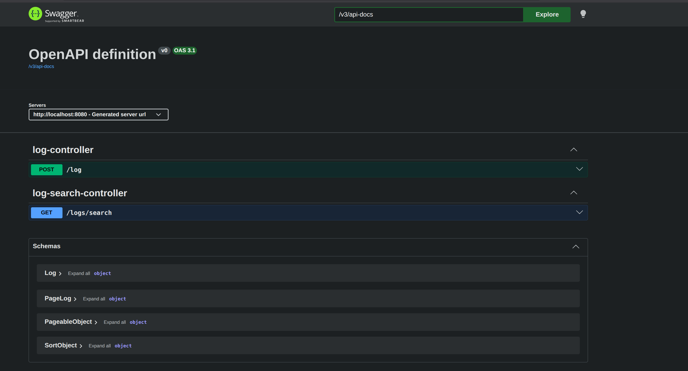
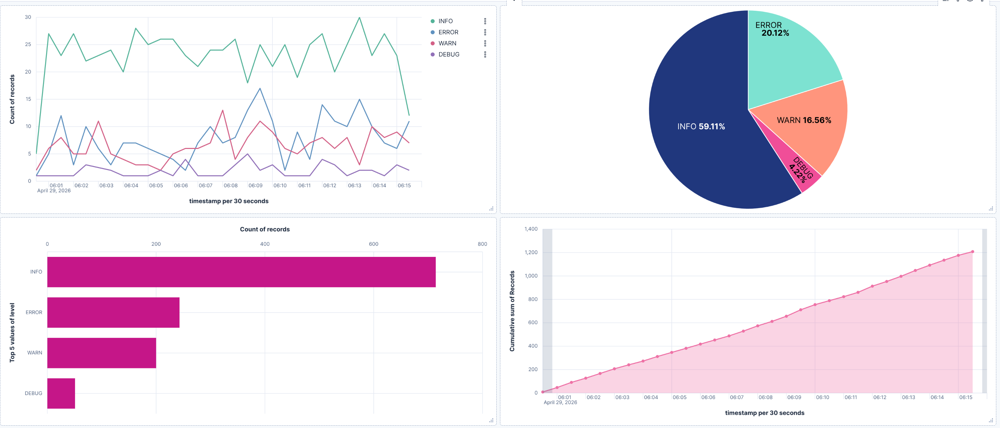

# Centralized Logging Platform

A centralized logging platform built with Spring Boot, Redis Streams, Elasticsearch, and Kibana.

This project collects logs from different services through a REST API, pushes them into Redis Streams, processes them asynchronously using consumer groups, stores them in Elasticsearch, and visualizes them in Kibana.

## Overview

The main idea of this project is to keep logs from multiple services in one place so they are easier to search, monitor, and analyze.

Instead of writing logs directly to Elasticsearch, the application first publishes them to Redis Streams. This makes the flow more flexible and helps separate log ingestion from log processing.

## Main Goal

The goal of this project is to provide a simple internal logging pipeline for distributed services.

It can be used for:
- Centralizing logs from multiple services
- Searching logs by service, level, message, and time range
- Viewing logs in Kibana
- Testing and exploring APIs with Swagger

## How It Works

The flow is simple:

1. A service sends a log to `POST /log`
2. The application publishes the log to Redis Streams
3. Consumer workers read logs from the stream using a consumer group
4. The logs are indexed into Elasticsearch
5. Kibana reads the Elasticsearch index and displays the logs

## Features

- Log ingestion through REST API
- Redis Streams for asynchronous processing
- Consumer group support for scalable workers
- Elasticsearch indexing and search
- Kibana dashboards and Discover view
- Swagger/OpenAPI for API testing

## Project Structure

```text
src/main/java/com/udemy/log
├── configuration
│   └── RedisConfig.java
├── controller
│   ├── LogController.java
│   └── LogSearchController.java
├── dao
│   ├── LogDAO.java
│   ├── LogDAOImpl.java
│   └── LogSearchRepository.java
├── entity
│   └── Log.java
├── Generator
│   ├── auth-service sender.py
│   └── billing-service sender.py
├── service
│   ├── ElasticLogService.java
│   ├── RedisStreamConsumerService.java
│   ├── RedisStreamSetupService.java
│   └── RedisConsumerRunner.java
└── LogApplication.java
```

## Log Model

Each log follows this structure:

```json
{
  "timestamp": "2026-04-27T02:38:00Z",
  "service": "auth-service",
  "level": "ERROR",
  "message": "jwt token validation failed"
}
```

The `Log` entity is used as the API payload model and also as the Elasticsearch document model.

## Tech Stack

- Spring Boot
- Spring Web
- Spring Data Redis
- Redis Streams
- Spring Data Elasticsearch
- Elasticsearch
- Kibana
- Springdoc OpenAPI

## Prerequisites

Make sure you have:

- Java
- Maven
- Docker
- Git

## Run the Infrastructure

If your containers already exist, start them with:

```bash
docker start redis elasticsearch kibana
```

If you want to create them from scratch:

### Redis

```bash
docker run -d --name redis -p 6379:6379 redis:latest
```

### Elasticsearch

```bash
docker run -d --name elasticsearch -p 9200:9200 \
-e discovery.type=single-node \
-e xpack.security.enabled=false \
-e ES_JAVA_OPTS="-Xms1g -Xmx1g" \
docker.elastic.co/elasticsearch/elasticsearch:9.2.0
```

### Kibana

```bash
docker run -d --name kibana -p 5601:5601 \
--add-host=host.docker.internal:host-gateway \
-e ELASTICSEARCH_HOSTS=http://host.docker.internal:9200 \
docker.elastic.co/kibana/kibana:9.2.0
```

## Verify Services

Check running containers:

```bash
docker ps
```

Test Redis:

```bash
docker exec -it redis redis-cli ping
```

Expected result:

```text
PONG
```

Test Elasticsearch:

```bash
curl http://localhost:9200
```

Open Kibana:

```text
http://localhost:5601
```

## Application Configuration

Example `application.properties`:

```properties
spring.application.name=Log
server.port=8080

spring.data.redis.host=localhost
spring.data.redis.port=6379

spring.elasticsearch.uris=http://localhost:9200

app.redis.stream.key=log-events
app.redis.stream.group=log-processors
app.redis.stream.workers=3
```

## Run the Application

```bash
mvn spring-boot:run
```

## Swagger UI

After starting the application, open:

```text
http://localhost:8080/swagger-ui.html
```



## API Endpoints

### Add Log

**Endpoint**

```http
POST /log
```

**Example**

```bash
curl -X POST http://localhost:8080/log \
-H "Content-Type: application/json" \
-d '{
  "timestamp": "2026-04-27T02:38:00Z",
  "service": "auth-service",
  "level": "INFO",
  "message": "user login successful"
}'
```

### Search Logs

**Endpoint**

```http
GET /logs/search
```

**Examples**

```bash
curl "http://localhost:8080/logs/search?service=auth-service"
curl "http://localhost:8080/logs/search?level=ERROR"
curl "http://localhost:8080/logs/search?message=timeout"
curl "http://localhost:8080/logs/search?from=2026-04-27T00:00:00Z&to=2026-04-27T23:59:59Z"
```

## Kibana Setup

After logs are indexed into Elasticsearch, create a data view in Kibana using your index name.

Use:
- Index pattern: your Elasticsearch index name
- Timestamp field: `timestamp`

Then open **Discover** to inspect logs and create dashboards if needed.

## Main Classes

- `LogController` handles incoming log requests
- `LogSearchController` handles search requests
- `ElasticLogService` saves and searches logs in Elasticsearch
- `RedisStreamConsumerService` consumes logs from Redis Streams
- `RedisStreamSetupService` creates the consumer group
- `RedisConsumerRunner` starts the consumers
- `Log` represents the log payload


## Troubleshooting

### Kibana cannot connect to Elasticsearch

If Kibana shows `ENOTFOUND host.docker.internal`, restart it with:

```bash
--add-host=host.docker.internal:host-gateway
```



### No logs appear in Kibana

Check the indices:

```bash
curl http://localhost:9200/_cat/indices?v
```

Check documents:

```bash
curl http://localhost:9200/app-logs/_search
```


If there is no data, send test logs first.

### Swagger UI not working

Check:

```text
http://localhost:8080/swagger-ui.html
```

And:

```text
http://localhost:8080/v3/api-docs
```

## Future Improvements

- Add authentication
- Add retention
- Add Docker Compose
